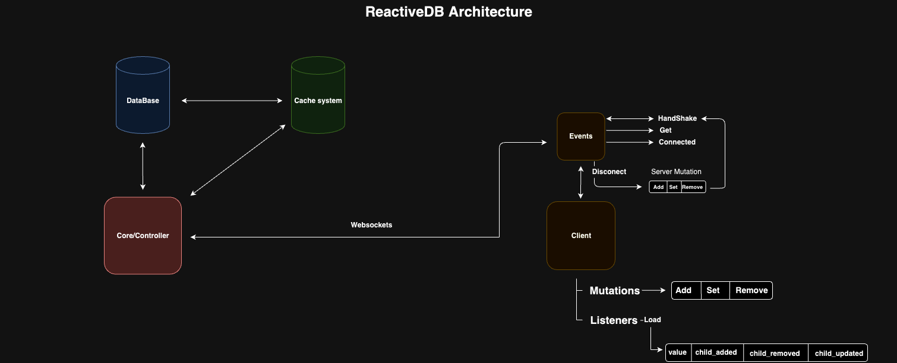

# ReactiveDB realtime database/backend

for mongodb (will support postgres, and DenoKV in the future) heavy inspired on firebase, pocketbase and supabase.

> (READ): The documentation is still under development so not all the functionalities of reactivedb are yet documented.

> History: The idea of ReactiveDB was born at the beginning of 2020 while I was working for a software company, the project I was in needed to have data synchronization between multiple users, originally we built everything around firebase which worked perfectly, but for client requirements it was necessary to have the entire infrastructure running on my own servers locally, so I was faced with the task of thinking of a solution that would meet these requirements and at the same time allow us not to have to change everything that was already closely coupled to the design from firebase, so ReactiveDB was born from here.

## Original diagram



## So what is ReactiveDB?

ReactiveDB aims, like firebase, supabase, poketbase, to provide a fast backend structure and listen to the changes that occur in the database in real time, but ReactiveDB takes the idea of being a framework/library which makes it easy to integrate it into a project already running or also start a project from scratch.

> example

```ts
import { ReactiveCore, Crypto } from "https://deno.land/x/reactivedb/mod.ts";
import { load } from "https://deno.land/std/dotenv/mod.ts";

// load envs
const {
  REACTIVE_USERNAME_DB,
  REACTIVE_PASSWORD_DB,
  REACTIVEE_HOST_DB,
  REACTIVE_DB_NAME,
  REACTIVE_DB_PORT,
  REACTIVE_SERVER_PORT,
  REACTIVE_JWK_BASE_64,
} = await load();

const crypt = new Crypto({ name: "HMAC", hash: "SHA-512" }, true, [
  "sign",
  "verify",
]);

const secretKey = await crypt.importFromJWKBase64(REACTIVE_JWK_BASE_64);

// start reactivedb
await ReactiveCore({
  connection: {
    host: REACTIVEE_HOST_DB,
    db: REACTIVE_DB_NAME,
    port: Number(REACTIVE_DB_PORT),
    tls: true,
    credential: {
      username: REACTIVE_USERNAME_DB,
      password: REACTIVE_PASSWORD_DB,
    },
  },
  port: Number(REACTIVE_SERVER_PORT),
  secretKey,
});
```

With these few lines of code you can have a complete backend and real-time connection with the collections within the database.

If you have a collection let's say "Users" in the database, reactive db will automatically create a rest api and a websockets channel to read and write data automatically.

> example: client deno

```ts
import {
  createClient,
  Auth,
} from "https://deno.land/x/reactivedb/client/mod.ts";

const url = "http://localhost:8080";

const auth = new Auth(url);

// login and auth
const token = await auth.loginWithEmailAndPassword(
  "email@example.com",
  "12345678"
);

// create instance
const ReactiveDB = createClient(url, token!);

// create a client
const client = ReactiveDB();

// connecto to a channel or collection from database
client.connectTo("Users", () => console.log("connected to Users"));

// listen events from collection
client.on("child_added", (data, event) => {
  console.log({ data, event });
});

// perform actions if connection close
client.onClose(() => {
  console.log("disconnected from Users");
});
```

and also exist a Restfull api to all collections

> example

```curl

GET: http://localhost:8080/v1/Users -> get all docs from Users collections

POST: http://localhost:8080/v1/Users '{ "name": "Jhon Doe", "password": "1234" }' -> push new data on Users collection

GET: http://localhost:8080/v1/Users/12345 -> get doc on collection by doc id

PUT, PATCH: http://localhost:8080/v1/Users/12345 '{ "name": "Jhon Smith", "password": "1234" }' -> update the doc from the collection by doc id
```

This rest api is automatic for all collections within the database, using the api automatically sends a notification to clients that are listening for changes.

## The basics

### How to start?

first install ReactiveDB:

```ts
import { ReactiveCore } from "https://deno.land/x/reactivedb/mod.ts";
```

or using Trex

```console
trex install reactivedb
```

now create a database on mongodb atlas or use a local mongodb server:

```ts
import { ReactiveCore, Crypto } from "https://deno.land/x/reactivedb/mod.ts";
import { load } from "https://deno.land/std/dotenv/mod.ts";

// load envs - we strongly recommend using environment variables
const {
  REACTIVE_USERNAME_DB,
  REACTIVE_PASSWORD_DB,
  REACTIVEE_HOST_DB,
  REACTIVE_DB_NAME,
  REACTIVE_DB_PORT,
  REACTIVE_SERVER_PORT,
  REACTIVE_JWK_BASE_64,
} = await load();
```

then generate a secure CryptoKey:

```ts
import { Crypto } from "https://deno.land/x/reactivedb/mod.ts";

const crypto = new Crypto({ name: "HMAC", hash: "SHA-512" }, true, [
  "sign",
  "verify",
]);

await crypto.generateKey();

const { toBase64 } = await crypto.exportToJWKBase64();

console.log(toBase64()); // eyJrdHkiOiJvY3QiLCJrIjoib040ek5FRmhrVEdkaWJTdHpOMTZwZ1.....
```

We recommend saving this token in an environment variable and not sharing it since the token is used to sign and verify JWTs.

`.env`

```env
REACTIVE_JWK_BASE_64="eyJrdHkiOiJvY3QiLCJrIjoib040ek5FRmhrVEdkaWJTdHpOMTZwZ1....."
```

> **Note:** Each CryptoKey is unique, so if it is changed to a new one, it will not be possible to verify the tokens created with the previous CryptoKey.

now load the CryptoKey:

```ts
import { ReactiveCore, Crypto } from "https://deno.land/x/reactivedb/mod.ts";
import { load } from "https://deno.land/std/dotenv/mod.ts";

// load envs
const {
  REACTIVE_USERNAME_DB,
  REACTIVE_PASSWORD_DB,
  REACTIVEE_HOST_DB,
  REACTIVE_DB_NAME,
  REACTIVE_DB_PORT,
  REACTIVE_SERVER_PORT,
  REACTIVE_JWK_BASE_64,
} = await load();

const crypt = new Crypto({ name: "HMAC", hash: "SHA-512" }, true, [
  "sign",
  "verify",
]);

// load the CryptoKey from previous step
const secretKey = await crypt.importFromJWKBase64(REACTIVE_JWK_BASE_64);

// start reactivedb
await ReactiveCore({
  connection: {
    host: REACTIVEE_HOST_DB,
    db: REACTIVE_DB_NAME,
    port: Number(REACTIVE_DB_PORT),
    tls: true,
    credential: {
      username: REACTIVE_USERNAME_DB,
      password: REACTIVE_PASSWORD_DB,
    },
  }, // or connection: "mongodb://localhost:27017/myDatabase"
  port: Number(REACTIVE_SERVER_PORT),
  secretKey,
});
```

## Advanced concepts

### ReactiveDB Functions

with ReactiveDB you can create your own endpoints called "Functions" these endpoints are structured using file system routing.

To create functions you just have to create a "functions" folder at the root of the project.

`functions/`

This is the anatomy of a reactive db function:

`functions/users.[get].ts`

- users: the name of the `endpoint/function` -> http://localhost:8080/users, `index` name is transformed to `/`

- [ get ] : the http methods supported by the `endpoint/function` -> all methods supported: get, post, put, delete, all.
  You can combine several methods for the same function: `users.[get,post,put].ts` or allow all methods `users.[all].ts`
- `.ts` -> file extension, supported file extensions: ts, js, tsx, jsx

Inside of the function looks like this:

`functions/user.[get].ts`

```ts
import type {
  Context,
  Utilities,
  Middleware,
} from "https://deno.land/x/reactivedb/mod.ts";
import {
  Handler,
  HandlerMiddlewares,
} from "https://deno.land/x/reactivedb/mod.ts";

// middlewares for this function
export const middlewares = HandlerMiddlewares([
  async (ctx, next) => {
    console.log(ctx.request.ip);

    await next();
  },
]);

// function
export default async function Index(context: Context, utils: Utilities) {
  try {
    const cursor = await utils.Database.collection("Users");

    const results = await cursor
      .find(undefined, { noCursorTimeout: false })
      .toArray();

    utils.Events.post({
      to: "Users",
      data: [],
      event: "child_added",
    });

    context.response.status = 200;
    context.response.body = results;
  } catch (error) {
    console.log(error);
  }
}
```

Now we will explain each part:

> **Note**: You can only export a single function per file and it must be exported by default:

```ts
export default async function Fn() {
  ....
}
```

Each function receives two parameters: `Context` and `Utilities`:

- `Context`: In the context are the `Response` and the `Request` of each http request, reactivedb is built on top of the Oak framework so it is managed like any app made in [Oak](https://deno.land/x/oak/mod.ts?s=Context)

```ts
export default async function Fn(context: Context) {
  const body = context.request.body({ type: "json" });

  context.response.status = 200;
  context.response.body = {
    ok: true,
  };
}
```

- `Utilities`: The utilities contain the connection to the database to make queries and add data to the collections. They also contain the method to dispatch events for the websocket connections that are listening.

```ts
export default async function Fn(context: Context, utils: Utilities) {
  try {
    // connect to Users collection
    const cursor = await utils.Database.collection("Users");

    // get all users from Users collection
    const results = await cursor
      .find(undefined, { noCursorTimeout: false })
      .toArray();

    // send to Users listeners
    utils.Events.post({
      to: "Users",
      data: [],
      event: "child_added",
    });

    context.response.status = 200;
    context.response.body = {
      ok: true,
    };
  } catch (error) {
    console.log(error);
  }
}
```

#### Middlewares

The functions support middlewares, so you can define all the middlewares you need in each function.

```ts
// middlewares list
export const middlewares = HandlerMiddlewares([
  async (ctx, next) => {
    console.log(ctx.request.ip);

    await next();
  },
]);

export default async function Fn(context: Context, utils: Utilities) {
  ....
}
```

It is important that the next function is called in each middleware, since if it is not done, the execution will not continue to the other middlewares and towards the function.

```ts
export const middlewares = HandlerMiddlewares([
  async (ctx, next) => {
    console.log(ctx.request.ip);

    await next(); // call it always
  },
]);
```

> **Note**: You must always export with the name `middlewares` so that the middlewares are loaded before the execution of the function.

```ts
export const middlewares = HandlerMiddlewares([
  ....
]);
```
